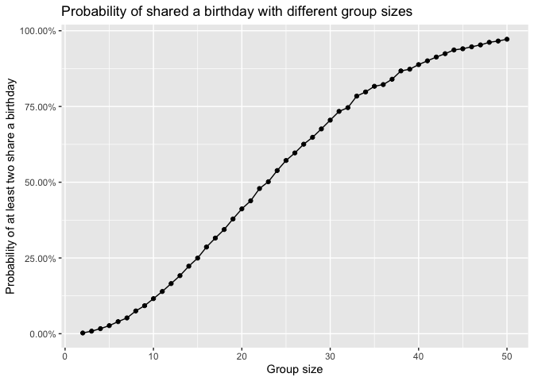
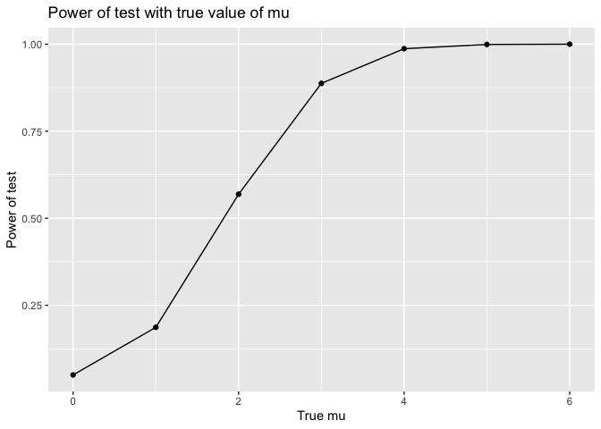
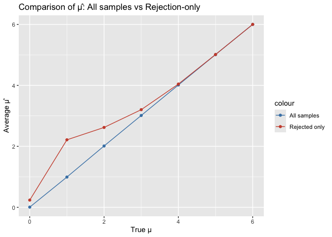

p8105_hw5_yg3099
================
daisy_gui
2025-11-16

``` r
library(tidyverse)
```

    ## ── Attaching core tidyverse packages ──────────────────────── tidyverse 2.0.0 ──
    ## ✔ dplyr     1.1.4     ✔ readr     2.1.5
    ## ✔ forcats   1.0.0     ✔ stringr   1.5.1
    ## ✔ ggplot2   3.5.2     ✔ tibble    3.2.1
    ## ✔ lubridate 1.9.4     ✔ tidyr     1.3.1
    ## ✔ purrr     1.1.0     
    ## ── Conflicts ────────────────────────────────────────── tidyverse_conflicts() ──
    ## ✖ dplyr::filter() masks stats::filter()
    ## ✖ dplyr::lag()    masks stats::lag()
    ## ℹ Use the conflicted package (<http://conflicted.r-lib.org/>) to force all conflicts to become errors

``` r
library(broom)
```

## Problem 1

In this function, random birthdays can be created and tell if there are
duplicated ones.

``` r
set.seed(1)

birthday_dup = function(n_people, n_days = 365) {
  birthdays = sample(1:n_days, size = n_people, replace = TRUE)
  
  any(duplicated(birthdays))
}
```

Now, stimulate 10,000 times for sample size 2~50 and calculate the
probability of occurring duplicated birthdays. Results are stored in
sim_results_df.

``` r
bd_prob_df = 
  expand_grid(
    group_size = 2:50,
    iter = 1:10000
  ) |> 
  mutate(
    dup = map_lgl(group_size, birthday_dup)
  ) |> 
  group_by(group_size) |> 
  summarize(
    prob_dup = mean(dup)
  )
```

The graph below shows the change in probability with group size from 2
to 50.

``` r
bd_prob_df |> 
  ggplot(aes(x = group_size, y = prob_dup)) +
  geom_line() +
  geom_point() +
  scale_y_continuous(labels = scales::percent_format(accuracy = 0.01)) +
  labs(
    x = "Group size",
    y = "Probability of at least two share a birthday",
    title = "Probability of shared a birthday with different group sizes"
  )
```

<!-- -->

According to the plot, the probability of at least two people sharing a
birthday increases rapidly as the group size grows from 2. When the
group size is around 23-24, the probability rises to about 50%. The rate
of increase then slow down when the group size increase. The probability
reaches 97.20% at group size n = 50. Overall, the probability of at
least two people sharing a birthday get closer and closer to 100% as the
group size grows.

## Problem 2

First, a function is written to generate one random sample and return
$\mu$ and p-value.

``` r
t_sample = function(n = 30, mu, sigma = 5) {
  x = rnorm(n, mean = mu, sd = sigma)
  
  test_res = t.test(x, mu = 0) |> tidy()
  
  tibble(
    mu_hat = mean(x),
    p_value = test_res$p.value
  )
}
```

Then do 5,000 stimulations with the function for $\mu = 0$ to $\mu = 6$.

``` r
t_result_df = 
  expand_grid(
    true_mu = 0:6,
    iter = 1:5000
  ) |> 
  mutate(
    estimate_df = map(true_mu, 
                      \(m) t_sample(mu = m))
  ) |> 
  unnest(estimate_df)
```

``` r
t_result_df
```

    ## # A tibble: 35,000 × 4
    ##    true_mu  iter  mu_hat p_value
    ##      <int> <int>   <dbl>   <dbl>
    ##  1       0     1 -1.62    0.0545
    ##  2       0     2 -0.542   0.569 
    ##  3       0     3 -0.278   0.767 
    ##  4       0     4 -0.303   0.733 
    ##  5       0     5  0.406   0.637 
    ##  6       0     6  0.147   0.881 
    ##  7       0     7  1.20    0.191 
    ##  8       0     8 -0.0542  0.957 
    ##  9       0     9 -0.119   0.878 
    ## 10       0    10 -1.89    0.0712
    ## # ℹ 34,990 more rows

Here’s the plot showing the proportion that h0 was rejected and the true
value of $\mu$.

``` r
pw_df = 
  t_result_df |> 
  mutate(reject = p_value < 0.05) |> 
  group_by(true_mu) |> 
  summarize(power = mean(reject))

pw_df |> 
  ggplot(aes(x = true_mu, y = power)) +
  geom_line() +
  geom_point() +
  labs(
    x = "True mu",
    y = "Power of test",
    title = "Power of test with true value of mu"
  )
```

<!-- -->

As the true value of $\mu$ increases, the power of the test increases
first rapidly and then slower after true value of $\mu = 3$. This shows
a strong positive association between effect size and power.

For the plot with average estimate of $\hat{\mu}$ on the y axis and the
true value of $\mu$ on the x axis, we need to first calculate average
$\hat{\mu}$ of all samples:

``` r
avg_mu_df = 
  t_result_df |> 
  group_by(true_mu) |> 
  summarize(avg_mu_hat = mean(mu_hat))
```

Next, calculate $\hat{\mu}$ of samples which h0 was rejected:

``` r
avg_mu_reject_df = 
  t_result_df |> 
  filter(p_value < 0.05) |> 
  group_by(true_mu) |> 
  summarize(avg_mu_hat_reject = mean(mu_hat))
```

The graph below compares average $\hat{\mu}$ from all samples and
samples which h0 get rejected with the change of true value of $\mu$.

``` r
avg_mu_df|> 
  left_join(avg_mu_reject_df, by = "true_mu") |> 
  ggplot(aes(x = true_mu)) +
  geom_line(aes(y =avg_mu_hat, color = "All samples")) +
  geom_point(aes(y =avg_mu_hat, color = "All samples")) +
  geom_line(aes(y =avg_mu_hat_reject, color = "Rejected only")) +
  geom_point(aes(y =avg_mu_hat_reject, color = "Rejected only")) +
  labs(
    x = "True μ",
    y = "Average μ̂",
    title = "Comparison of μ̂: All samples vs Rejection-only"
  ) + scale_color_manual(values = c(
    "All samples" = "steelblue",
    "Rejected only" = "tomato3"
    ))
```

<!-- -->

The sample average of $\hat{\mu}$ across the tests for which the null is
rejected is not approximately equal to the true value of $\mu$ when the
true $\mu$ value is small.They get more similar when the true $\mu$
value increase.

Because including only cases which reject the null introduces selection
bias.

For positive means, samples larger than average tend to be rejected,
samples smaller tend not to be reject. So the subset with rejected h0
only samples subset contains a disproportionate number of high estimates
of $\mu$

## Problem 3

Import data from csv.

``` r
homicides_df = read_csv("data/homicide-data.csv")
```

    ## Rows: 52179 Columns: 12
    ## ── Column specification ────────────────────────────────────────────────────────
    ## Delimiter: ","
    ## chr (9): uid, victim_last, victim_first, victim_race, victim_age, victim_sex...
    ## dbl (3): reported_date, lat, lon
    ## 
    ## ℹ Use `spec()` to retrieve the full column specification for this data.
    ## ℹ Specify the column types or set `show_col_types = FALSE` to quiet this message.

``` r
homicides_df
```

    ## # A tibble: 52,179 × 12
    ##    uid        reported_date victim_last  victim_first victim_race victim_age
    ##    <chr>              <dbl> <chr>        <chr>        <chr>       <chr>     
    ##  1 Alb-000001      20100504 GARCIA       JUAN         Hispanic    78        
    ##  2 Alb-000002      20100216 MONTOYA      CAMERON      Hispanic    17        
    ##  3 Alb-000003      20100601 SATTERFIELD  VIVIANA      White       15        
    ##  4 Alb-000004      20100101 MENDIOLA     CARLOS       Hispanic    32        
    ##  5 Alb-000005      20100102 MULA         VIVIAN       White       72        
    ##  6 Alb-000006      20100126 BOOK         GERALDINE    White       91        
    ##  7 Alb-000007      20100127 MALDONADO    DAVID        Hispanic    52        
    ##  8 Alb-000008      20100127 MALDONADO    CONNIE       Hispanic    52        
    ##  9 Alb-000009      20100130 MARTIN-LEYVA GUSTAVO      White       56        
    ## 10 Alb-000010      20100210 HERRERA      ISRAEL       Hispanic    43        
    ## # ℹ 52,169 more rows
    ## # ℹ 6 more variables: victim_sex <chr>, city <chr>, state <chr>, lat <dbl>,
    ## #   lon <dbl>, disposition <chr>

The raw dataset contains 52,179 observations, which are homicide cases
from 50 major U.S. cities. It contains 12 variables in total.

Each row represents one homicide and includes key variables like victim
information including name, age, race and sex. Variables also include
city, state, geographic coordinates, the report date, and the case
disposition.

Next, a dataframe on cities in different states, number of homicides,
and the number of unsolved homicides is generated.

``` r
homicide_city = 
  homicides_df |>
  mutate(
    city_state = str_c(city, ", ", state),
    unsolved = disposition %in% c("Closed without arrest", "Open/No arrest")
  ) |>
  group_by(city_state) |>
  summarize(
    total = n(),
    unsolved = sum(unsolved),
    .groups = "drop"
  )
```

Proportion of unsolved homicides in the city of Baltimore and the
estimated proportion and confidence intervals are calculated.

``` r
baltimore =
  homicide_city |>
  filter(city_state == "Baltimore, MD")

baltimore_test =
  prop.test(baltimore$unsolved, baltimore$total)

baltimore_tidy =
  broom::tidy(baltimore_test)

baltimore_tidy |> 
  select(estimate, conf.low, conf.high)
```

    ## # A tibble: 1 × 3
    ##   estimate conf.low conf.high
    ##      <dbl>    <dbl>     <dbl>
    ## 1    0.646    0.628     0.663
